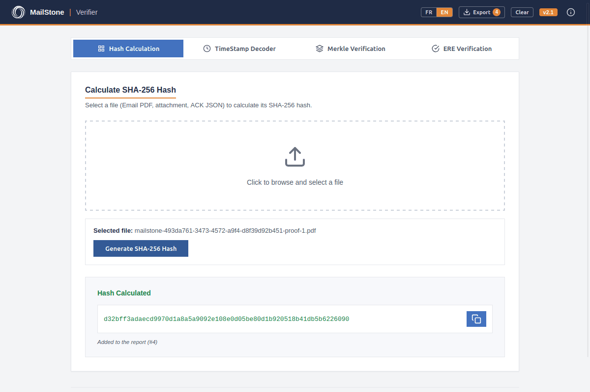
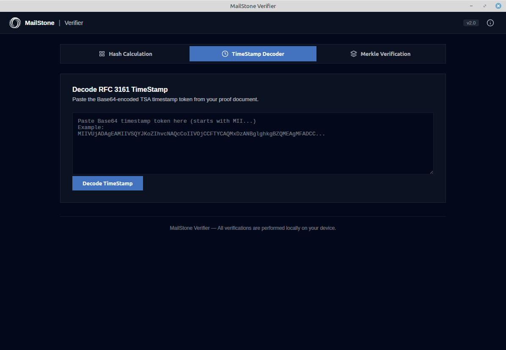
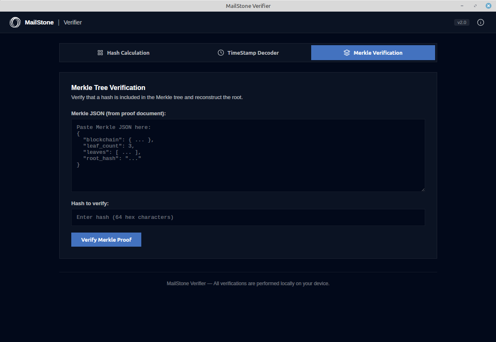

<p align="center">
  
</p>

# MailStone Verifier


**MailStone Verifier** is an open-source desktop application for verifying the proofs MailStone issues: certified emails (*mail opposable*) and registered electronic deliveries (*Envoi Recommandé Électronique*, ERE). It provides four tools:

1. **Hash Calculator** - Calculate SHA-256 hashes of files (Email PDFs, attachments, ACK JSON)
2. **TimeStamp Decoder** - Decode and verify RFC 3161 TSA timestamp tokens, and check which hash they cover
3. **Merkle Verifier** - Verify that a hash is included in a Merkle tree and reconstruct the root
4. **ERE Verifier** - Check the recipient's Ed25519 decision signature and recompute the evidence hash of every event of a delivery

---

## Features

- ✅ **SHA-256 Hash Calculation** - Fast and secure hashing of any file
- ✅ **RFC 3161 Timestamp Verification** - Signature checked against the embedded TSA certificate; provider, date, serial number, hash algorithm, signer identity; optional check that the token covers a given hash (a Merkle root, a file)
- ✅ **Merkle Tree Verification** - Reconstruct Merkle root and verify leaf inclusion (single-leaf ERE blocks and multi-leaf V2 blocks)
- ✅ **ERE Decision Signature** - Ed25519 verification of the recipient's accept / refuse decision
- ✅ **ERE Evidence Hashes** - Recompute the anchored leaf of each delivery event from the facts printed in the proof
- ✅ **Standalone Binaries** - No installation required, runs on macOS, Linux, and Windows
- ✅ **User-Friendly GUI** - Web-based interface powered by Wails, in **English and French** (switch in the title bar; follows the system language by default)
- ✅ **Session report** - Every verification is journaled; export the whole session as a text report or as JSON from the title bar
- ✅ **Open Source** - MIT licensed, transparent and auditable

---

## Screenshots

### Hash Calculation
Calculate SHA-256 hash of any file with a simple drag-and-drop interface.



### TimeStamp Decoder
Decode Base64-encoded TSA timestamp tokens and view provider, date, serial number and hash algorithm.



### Merkle Verification
Verify file inclusion in the Merkle tree and reconstruct the root hash from the proof JSON.



---

## Installation

### Download Pre-built Binaries

Download the latest release for your platform from the [Releases](https://github.com/mailstone/mailstone-verifier/releases) page:

- **macOS**: `mailstone-verifier-darwin-amd64` (Intel) or `mailstone-verifier-darwin-arm64` (Apple Silicon)
- **Linux**: `mailstone-verifier-linux-amd64`
- **Windows**: `mailstone-verifier-windows-amd64.exe`

Make the binary executable (macOS/Linux):
```bash
chmod +x mailstone-verifier-*
./mailstone-verifier-darwin-arm64
```

### Build from Source

#### Automatic Setup (Recommended)

Run the setup script to install all dependencies automatically:

```bash
# Clone the repository
git clone https://github.com/mailstone/mailstone-verifier.git
cd mailstone-verifier

# Run setup script (installs Wails + dependencies)
./setup.sh

# Run in development mode
make dev
```

#### Manual Setup

**Prerequisites:**
- Go 1.24 or higher
- Wails v2 (`go install github.com/wailsapp/wails/v2/cmd/wails@latest`)
- Platform dependencies (see [BUILD.md](BUILD.md))

**Steps:**
```bash
# Clone the repository
git clone https://github.com/mailstone/mailstone-verifier.git
cd mailstone-verifier

# Install dependencies
go mod download

# Add GOPATH/bin to PATH
export PATH=$PATH:$(go env GOPATH)/bin

# Run in development mode
wails dev

# Build for your platform
wails build

# Cross-compile for other platforms
wails build -platform darwin/amd64,darwin/arm64,linux/amd64,windows/amd64
```

Binaries will be in the `build/bin/` directory.

---

## Usage

### 1. Hash Calculation

**Purpose:** Calculate the SHA-256 hash of a file to verify its integrity.

**Steps:**
1. Open the **Hash Calculation** tab
2. Click to browse or drag & drop a file (Email PDF, attachment, ACK JSON)
3. Click **Generate SHA-256 Hash**
4. Copy the hash to clipboard using the copy button

**Use Case:** Compare this hash with the hash listed in your MailStone proof document to verify the file hasn't been tampered with.

---

### 2. TimeStamp Decoder

**Purpose:** Decode RFC 3161 TSA timestamp tokens to view timestamp details.

**Steps:**
1. Open the **TimeStamp Decoder** tab
2. Copy the Base64-encoded timestamp token from your proof document (starts with `MII...`)
3. Paste it into the textarea
4. Click **Decode TimeStamp**

**Output:**
- **Provider:** TSA authority (e.g., MailStone TimeStamp, Unataca, FreeTSA)
- **Date & Time:** Exact timestamp in UTC
- **Serial Number:** Unique identifier for this timestamp
- **Hash Algorithm:** Algorithm used (e.g., SHA-256, SHA-256)
- **Status:** GRANTED or FAILED

---

### 3. Merkle Verification

**Purpose:** Verify that a file is included in the Merkle tree and reconstruct the root.

**Steps:**
1. Open the **Merkle Verification** tab
2. Paste the Merkle JSON from your proof document into the first textarea
3. Paste the hash you want to verify into the second input field (you can use the hash from Tab 1)
4. Click **Verify Merkle Proof**

**Output:**
- ✅ **Success:** Calculated root matches expected root (file is authentic)
- ❌ **Failure:** Roots don't match (file may be tampered with)
- **Position:** Leaf index in the tree (e.g., Leaf #2 / 3 total leaves)
- **Type:** Entity type (EMAIL, ATTACHMENT, ACK, ERE, ERE_ATTACHMENT, ERE_PRESENTATION)

The hash field may be left empty: the block's own leaf is then verified, which is how the single-leaf blocks of an ERE proof are meant to be used.
- **Merkle Path:** Step-by-step reconstruction (click to expand)

---

### 4. ERE Verification

**Purpose:** Verify a *Dossier de preuve* of a Registered Electronic Delivery beyond its Merkle blocks.

**Recipient decision signature**

The recipient accepted or refused the delivery by signing a four-line text with an Ed25519 private key that never left their device. The proof prints the public key, the signature and the exact text.

1. Open the **ERE Verification** tab
2. Paste the public key and the signature from the "Décision du destinataire" section
3. Paste the four-line block exactly as printed (or fill in `ere_id`, `decision`, `decided_at`)
4. Click **Verify Decision Signature**

Ed25519 is a signature scheme, not a hash: the tool gives the message, the public key and the signature to the algorithm and reports **true or false**. True means the holder of that key signed exactly this decision, for exactly this delivery, at exactly this time; a single different byte gives false. The signed `decided_at` is RFC 3339 UTC (`2026-10-05T09:36:36Z`), and every line, the last included, ends with a line feed — the tool normalises a block pasted without the final one.

**Event evidence hash**

Every event of a delivery is anchored as its own Merkle leaf. The leaf is the SHA-256 of a short canonical text committing to the event's facts:

| Event | Hashed text (lines joined by `\n`) |
|---|---|
| Deposit (receipt) | `ere-deposit:v1`, ere_id, sender email, recipient email, subject, content hash (hex) |
| Content | the SHA-256 of the Email PDF itself (use the Hash tab) |
| Dispatch | `ere-emission:v1`, ere_id, provider message id, hand-over time (RFC 3339, fractional seconds) |
| First presentation | `ere-delivery:v1`, ere_id, delivery time (RFC 3339), provider message id |
| Later presentation | `ere-presentation:v1`, ere_id, ordinal, delivery time, provider message id |
| Decision | raw signature bytes, then `\nreceived_at=` + platform receipt time (RFC 3339) |
| Cancellation | `ere/abort/v1\nere_id=…\nsender_user=…\naborted_at=…\n` |
| Expiry | ere_id + `|expired|` + expiry time (RFC 3339) |

1. Pick the event and enter the facts printed in the proof (values are kept when you switch events). For the content event, hash the Email PDF file directly from the card.
2. Optionally paste the event's proof block (the "Preuve Merkle (JSON)" of the matching "Preuve d'étape" card) and click **Compute Leaf Hash**: the tool rebuilds the leaf, checks it is the block's leaf (`leaf_hash`) and reconstructs the anchored root. Without the block, **Use in Merkle tab** carries the hash over.
3. In the **TimeStamp Decoder**, paste the event's TSA token with the block's `root_hash` as the hash to cover: the token's date is then the opposable date of that event

Times are hashed in UTC; a time pasted with a zone is converted.

---

## Merkle JSON Format

The Merkle JSON should follow this format (from MailStone proof documents):

```json
{
  "blockchain": {
    "ledger": "1435173",
    "network": "testnet",
    "provider": "Stellar",
    "tx_hash": "46e9a41208459bffeb9d68288be4f151326c5cc1a665519b15549d88f383512d"
  },
  "leaf_count": 3,
  "leaves": [
    {
      "entity_id": "caecb78e-30a6-46db-bde7-2460f81f7d84",
      "entity_type": "email",
      "leaf_hash": "95936cb47dc3de3b84ff43bf40476f779555db241f616c0c95f9224a59a4be44",
      "leaf_index": 0,
      "merkle_path": [
        {
          "level": 0,
          "position": "LEFT",
          "sibling_hash": "fbaf52109b712e295d2a398f025ccacec47cf2e732409f268a6cf429bb4bd996"
        }
      ]
    }
  ],
  "root_hash": "d94edba57b23719c0be436e51d4f408b6e19635856197874900ebd76992c7942"
}
```

---

## Development

### Project Structure

```
mailstone-verifier/
├── main.go                 # Wails entry point
├── app.go                  # Backend API (CalculateHash, DecodeTimestamp, VerifyMerkle, VerifyEreDecision, ComputeEreEvidenceHash)
├── internal/
│   ├── hasher/             # SHA-256 hash calculation
│   ├── timestamp/          # RFC 3161 timestamp decoder + signature check
│   ├── merkle/             # Merkle tree verification
│   ├── signature/          # Ed25519 recipient-decision verification (ERE)
│   └── evidence/           # ERE event evidence-hash recomputation
├── frontend/
│   ├── index.html          # UI with 4 tabs
│   ├── style.css           # Light MailStone theme
│   ├── i18n.js             # English / French dictionary and language switch
│   ├── report.js           # Session journal and report export (text / JSON)
│   └── app.js              # Frontend logic
├── build/
│   ├── make_icons.py       # Generates the icons below from the MailStone mark
│   ├── appicon.png         # Source icon (macOS / Windows bundles)
│   ├── windows/icon.ico    # Windows executable icon
│   ├── darwin/iconfile.icns# macOS bundle icon
│   └── linux/appicon.png   # Linux window icon
├── go.mod
├── wails.json
├── README.md
└── LICENSE
```

### Technologies

- **Backend:** Go 1.24+
  - [Wails v2](https://wails.io/) - Desktop app framework
  - Go standard library `crypto/sha256` - SHA-256 hashing
  - [digitorus/timestamp](https://github.com/digitorus/timestamp) - RFC 3161 parsing
- **Frontend:** HTML/CSS/JavaScript (vanilla, no frameworks)

### Running Tests

```bash
# Run all tests
go test ./...

# Run with coverage
go test -coverprofile=coverage.out ./...
go tool cover -html=coverage.out
```

---

## Contributing

Contributions are welcome! Please follow these guidelines:

1. Fork the repository
2. Create a feature branch (`git checkout -b feature/amazing-feature`)
3. Commit your changes (`git commit -m 'Add amazing feature'`)
4. Push to the branch (`git push origin feature/amazing-feature`)
5. Open a Pull Request

---

## License

This project is licensed under the MIT License - see the [LICENSE](LICENSE) file for details.

---

## About MailStone

MailStone is a blockchain-based email certification platform that provides cryptographic proof of email authenticity and timestamp. Learn more at [mailstone.io](https://mailstone.io).

---


## Acknowledgments

- [Wails](https://wails.io/) - Go desktop framework
- [digitorus/timestamp](https://github.com/digitorus/timestamp) - RFC 3161 implementation
- [smallstep/pkcs7](https://github.com/smallstep/pkcs7) - PKCS#7 / CMS parsing

---

**Made with ❤️ by the MailStone team**
